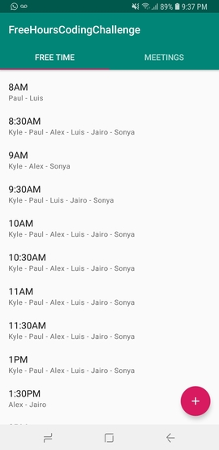
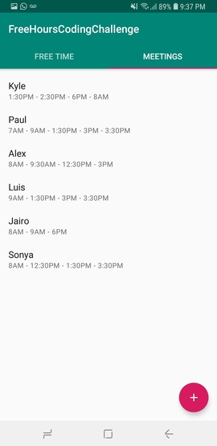
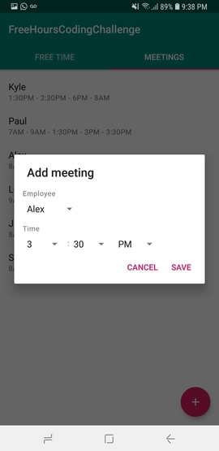

# Task Easy Coding Challenge

## Instructions
Due date: January Thursday 3rd 2019.

Use any language to write a program that achieves desired result

Send us the code, the input, and the output 

### Given: 
  Kyle has meetings at 1:30PM, 2:30PM, and 6PM
  
  Paul has meetings at 7AM, 9AM, 1:30PM, 3PM, and 3:30PM
  
  Alex has meetings at 8AM, 9:30AM, 12:30PM, and 3PM
  
  Luis has meetings at 9AM, 1:30PM, 3PM, and 3:30PM
  
  Jairo has meetings at 8AM, 9AM, and 6PM
  
  Sonya has a meeting at 8AM, 12:30PM, 1:30PM, 3:30PM


_Office hours are 8AM-5PM_

_Lunch is 12PM-1PM_

_All meetings are half an hour long_

### Desired Result:
Return all the times when at least three people are available and who those people are

Result should be in a format that can be used as an input for another program

## Solution
The solution was written using Kotlin and it runs on the JVM.

### Code
The main entry point of the app is [main.kt](jvm-app/src/main/kotlin/Main.kt).

The rest of the logic is in the [freehourslib](freehourslib/src/main/kotlin/com/jmlabs/freehourslib).

Where:
* [MeetingsSchedules.kt](freehourslib/src/main/kotlin/com/jmlabs/freehourslib/MeetingsSchedules.kt): Represents "company" employee schedules, gives access to employees meetings and employees free time
* [EmployeeMeetings.kt](freehourslib/src/main/kotlin/com/jmlabs/freehourslib/EmployeeMeetings.kt): Represents a list of time meetings of an employee. This class get serialized to Json:
 ```json
  {
    "name": "Kyle",
    "meetings": ["8AM", "1:30PM", "2PM"]
  }
```
* [FreeTime.kt](freehourslib/src/main/kotlin/com/jmlabs/freehourslib/FreeTime.kt): Represents a list of employees that are free at a specific time. This class gets serialized to Json:
```json
  {
    "time": "3:30PM",
    "employees": ["Kyle", "Luis", "Alex"]
  }
```

### Input
1. Path to json file
1. File name of output json file (optional)

Input JSON file has to have this sintax:
```json
  [
    {
      "name": "Kyle",
      "meetings": ["1:30PM", "2:30PM", "6PM"]
    },
    {
      "name": "Paul",
      "meetings": ["7AM", "9AM", "1:30PM", "3PM", "3:30PM"]
    },
    ...
  ]
```
Example file: [input.json](input.json)

### Output
The output is a json file with the following sintax:
```json
  [
    {
      "time":"8AM",
      "employees":["Kyle","Paul","Luis"]
    },
    {
      "time":"8:30AM",
      "employees":["Kyle","Paul","Alex","Luis","Jairo","Sonya"]
    },
    ...
  ]
```
Example file: [output.json](output.json)

### Run
```shell
  java -jar jvm-app.jar input.json output.json
```
This will get as input the file from the relative path `./input.json` and writes the output to the relative path `./output.json`.


### Dependencies
* Java Runtime Enviroment 7 or greater
* Android Studio (Needed for building android app)

### Build
To be able to build the jar using gradle you need to open the project with android studio.
This will create a local.properties file where the android sdk path is set.

```shell
  git clone https://github.com/jimmymorales/taskeasycodingchallenge.git
  cd taskeasycodingchallenge
  ./gradlew :jvm-app:build
```
This generates a .jar file in `jvm-app/build/libs/jvm-app.jar`.

### Run tests
```shell
  ./gradlew test
```
This will generate a html report. You can see the report in the following path:
`freehourslib/build/reports/tests/test/index.html`

Tests are in the path [freehourslib/src/test/kotlin/com/jmlabs/freehourslib](freehourslib/src/test/kotlin/com/jmlabs/freehourslib)

## Bonus
Since this challenge is for getting an android developer job opportunity, I also decided to spend some time doing a small app where you can see the list of meetings and employees and the free time of each employee in work hours.

You can download the apk from [here](https://github.com/jimmymorales/taskeasycodingchallenge/releases/tag/v0.0.1). Or use android studio to build and run the app on a device.

### Screenshots



